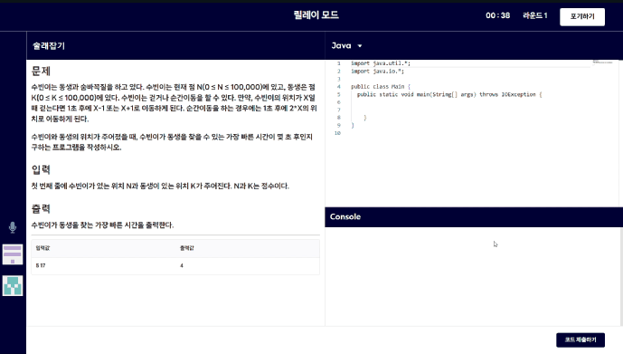
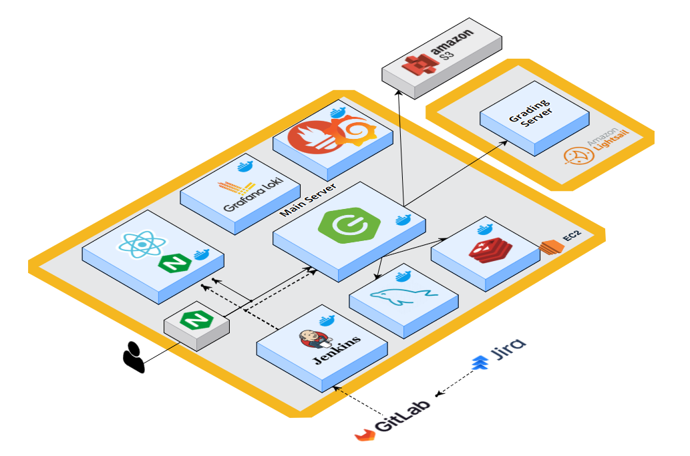
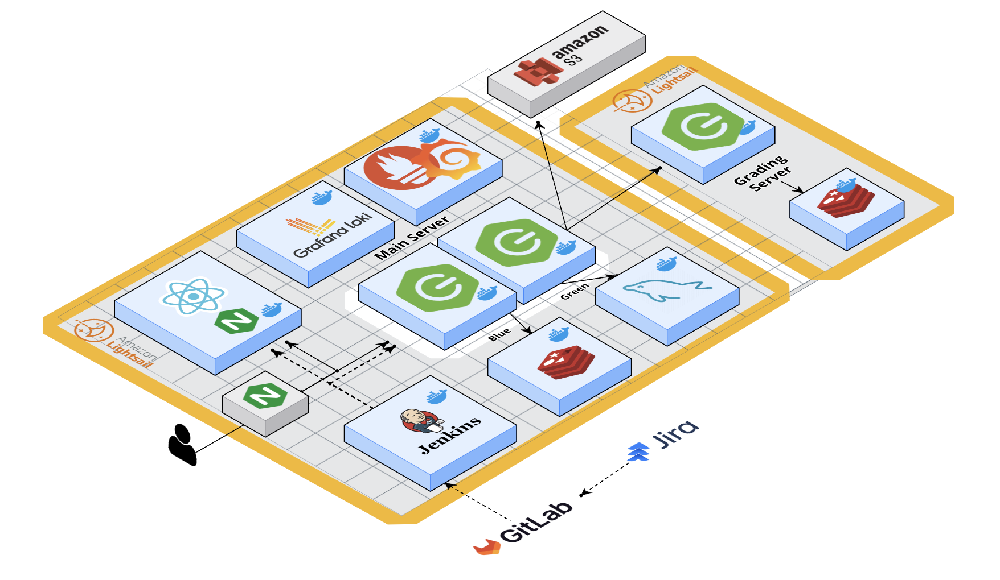

# 💪개발자를 위한 협업 코딩 서비스, [URTURN]

알고리즘과 페어 프로그래밍을 접목하여 쉽고 재미있게 협업 경험을 쌓아보세요!

## 📌 기획 배경

개발자들이 협업을 하면서 다른 사람의 코드 이해에 어려움을 겪고,

내 코드를 남이 이해하지 못하여 설명하는데 시간을 뺏기거나 애를 먹는 경우가 많습니다.

이렇듯 서로의 코드를 쉽게 이해하지 못하는 상황은 많은 리소스를 낭비하게 하고,

프로젝트 생산성을 저하 시킨다는 문제점을 발생시킵니다.

이를 개선하기 위해 알고리즘 문제 풀이와 페어 프로그래밍을 결합한 서비스를 기획하였습니다.

## 💡 주요 기능

#### 1. 방 생성 및 입장 / 난이도 설정

#### 2. 문제 읽기 및 풀이

#### 3. 코드 스위칭

#### 4. 음성 채팅 및 이모티콘

#### 4. 깃허브 업로드

## ⏰ 개발 기간

2024.04.08 ~ 2024.5.17 (6주)

## 👩 팀 구성

| [윤길재](https://github.com/747Socker)                                                     | [한태희](https://github.com/nyanpasu-life)                                                              | [이혜지](https://github.com/lee02g29)                                                     | [정덕주](https://github.com/Damongsanga)                                                   | [우창진](https://github.com/cjwoo96)                                                       |
| ------------------------------------------------------------------------------------------ | ------------------------------------------------------------------------------------------------------- | ----------------------------------------------------------------------------------------- | ------------------------------------------------------------------------------------------ | ------------------------------------------------------------------------------------------ | --- |
|  |               |  |  |  | <   |
| Leader, Frontend                                                                           | Frontend                                                                                                | Frontend                                                                                  | CI&CD, Backend                                                                             | Backend                                                                                    |
| 팀장 로그인 및 마이페이지 음성 채팅 기능 with RTC                                    | 상태 관리 및 로직 구성 메인 로직 with 웹소켓/StompJS 코드 공유 및 이모티콘  전송 기능 with RTC | UX/UI 랜딩 페이지 및  전체 페이지 디자인                                         | CI/CD 및 모니터링 채점 & 회고 도메인 인증/인가                                       | 방 & 문제 풀이 도메인 방 입/퇴장 구현 페어/스위칭 모드 기능구현                      |

## 🛠️ 기술 스택

### Front

![typescript][typescript] ![React][React] ![stomp.js][stomp.js] ![HTML5][HTML5] ![CSS3][CSS3]

### Back

![Java][Java] ![springboot][springboot] ![springdatajpa][springdatajpa] ![querydsl][querydsl] ![springsecurity][springsecurity] ![oauth][oauth]

### Cooperation

![gitlab][gitlab] ![Jira][Jira] ![mattermost][mattermost] ![discord][discord] ![figma][figma] ![notion][notion]

### Infrastructure

![amazonec2][amazonec2] ![nginx][nginx] ![docker][docker] ![jenkins][jenkins] ![mysql][mysql] ![redis][redis] ![Sonarqube][sonarqube] ![amazons3][amazons3] ![prometheus][prometheus] ![grafana][grafana] ![promtailloki][promtailloki] ![openvidu][openvidu]

## 🎨 아키텍처

- 채점 서버 오픈 소스 ([judge 0](https://ce.judge0.com/)) 사용시 아키텍처

- 최종 아키텍처 (채점 서버 구현)

## 🌐 Version Info & Setting

[메뉴얼 바로가기](./exec/porting_manual.md)

[openai]: https://img.shields.io/badge/openai--222222?style=for-the-badge&logo=openai&logoColor=222222
[stablediffusion]: https://img.shields.io/badge/stable_diffusion--412991?style=for-the-badge
[Java]: https://img.shields.io/badge/Java--FC6D26?style=for-the-badge&logo=java&logoColor=white
[JavaScript]: https://img.shields.io/badge/JavaScript--F7DF1E?style=for-the-badge&logo=JavaScript&logoColor=white
[CSS3]: https://img.shields.io/badge/CSS3--1572B6?style=for-the-badge&logo=CSS3&logoColor=1572B6
[HTML5]: https://img.shields.io/badge/HTML5--E34F26?style=for-the-badge&logo=HTML5&logoColor=E34F26
[Python]: https://img.shields.io/badge/Python--3776AB?style=for-the-badge&logo=python&logoColor=3776AB
[git]: https://img.shields.io/badge/git--F05032?style=for-the-badge&logo=git&logoColor=white
[gitlab]: https://img.shields.io/badge/gitlab--FC6D26?style=for-the-badge&logo=gitlab&logoColor=FC6D26
[Jira]: https://img.shields.io/badge/Jira--0052CC?style=for-the-badge&logo=jirasoftware&logoColor=0052CC
[mattermost]: https://img.shields.io/badge/mattermost--0058CC?style=for-the-badge&logo=mattermost&logoColor=0058CC
[discord]: https://img.shields.io/badge/discord--5865F2?style=for-the-badge&logo=discord&logoColor=5865F2
[figma]: https://img.shields.io/badge/figma--F24E1E?style=for-the-badge&logo=figma&logoColor=F24E1E
[notion]: https://img.shields.io/badge/notion--000000?style=for-the-badge&logo=notion&logoColor=000000
[intellij]: https://img.shields.io/badge/intellij--000000?style=for-the-badge&logo=intellijidea&logoColor=white
[vscode]: https://img.shields.io/badge/vscode--007ACC?style=for-the-badge&logo=visualstudiocode&logoColor=white
[workbench]: https://img.shields.io/badge/workbench--4479A1?style=for-the-badge&logo=mysql&logoColor=white
[springboot]: https://img.shields.io/badge/spring_boot-v3.2.3-6DB33F?style=for-the-badge&logo=springboot&logoColor=6DB33F
[Vue.js]: https://img.shields.io/badge/Vue.js-v3.4.15-35495E?style=for-the-badge&logo=vuedotjs&logoColor=4FC08D
[React]: https://img.shields.io/badge/React-v18.2.66-61DAFB?style=for-the-badge&logo=react&logoColor=61DAFB
[Sonarqube]: https://img.shields.io/badge/sonarqube-v4.2.0.3129-4E9BCD?style=for-the-badge&logo=sonarqube&logoColor=4E9BCD
[fastapi]: https://img.shields.io/badge/fastAPI-v0.109.0-009688?style=for-the-badge&logo=fastapi&logoColor=4FC08D
[amazonec2]: https://img.shields.io/badge/amazon_ec2-Ubuntu_20.04-FF9900?style=for-the-badge&logo=amazonec2&logoColor=FF9900
[nginx]: https://img.shields.io/badge/nginx-v1.25.0-009639?style=for-the-badge&logo=nginx&logoColor=4FC08D
[redis]: https://img.shields.io/badge/redis-v7.2.4-DC382D?style=for-the-badge&logo=redis&logoColor=DC382D
[mysql]: https://img.shields.io/badge/mysql-v8.0.36-4479A1?style=for-the-badge&logo=mysql&logoColor=4479A1
[docker]: https://img.shields.io/badge/docker-v25.0.4-2496ED?style=for-the-badge&logo=docker&logoColor=2496ED
[jenkins]: https://img.shields.io/badge/jenkins-v2.441-D24939?style=for-the-badge&logo=jenkins&logoColor=D24939
[prometheus]: https://img.shields.io/badge/prometheus--E6522C?style=for-the-badge&logo=prometheus&logoColor=E6522C
[grafana]: https://img.shields.io/badge/grafana--F46800?style=for-the-badge&logo=grafana&logoColor=F46800
[promtailloki]: https://img.shields.io/badge/loki--D24939?style=for-the-badge&logo=loki&logoColor=D24939
[openvidu]: https://img.shields.io/badge/openvidu--6DB33F?style=for-the-badge&logo=openvidu&logoColor=6DB33F
[stomp.js]: https://img.shields.io/badge/stomp.js--000000?style=for-the-badge&logo=stomp.js&logoColor=000000
[amazons3]: https://img.shields.io/badge/amazons3--569A31?style=for-the-badge&logo=amazons3&logoColor=569A31
[typescript]: https://img.shields.io/badge/typescript--3178C6?style=for-the-badge&logo=typescript&logoColor=3178C6
[springdatajpa]: https://img.shields.io/badge/SPRING_DATA_JPA--6DB33F?style=for-the-badge&logoColor=white
[querydsl]: https://img.shields.io/badge/querydsl-v5.0.0-669DF6?style=for-the-badge&logoColor=white
[springsecurity]: https://img.shields.io/badge/SPRING_SECURITY--6DB33F?style=for-the-badge&logo=springsecurity&logoColor=6DB33F
[oauth]: https://img.shields.io/badge/OAUTH--2F2F2F?style=for-the-badge&logo=OAUTH&logoColor=white
